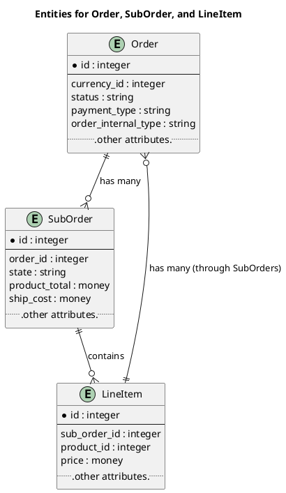
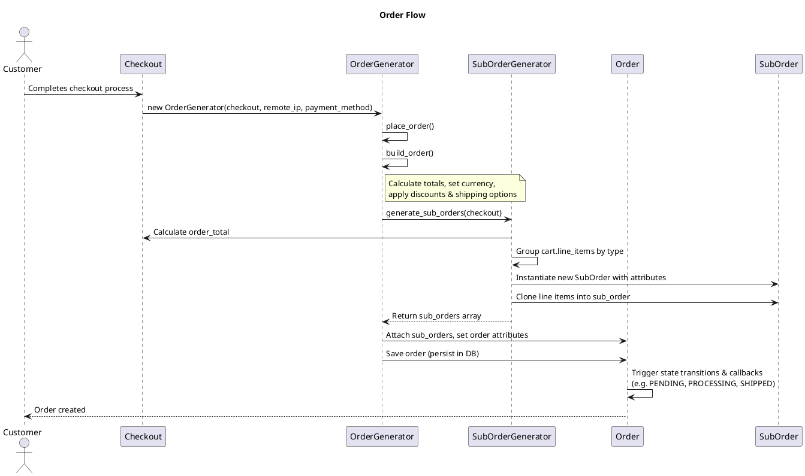
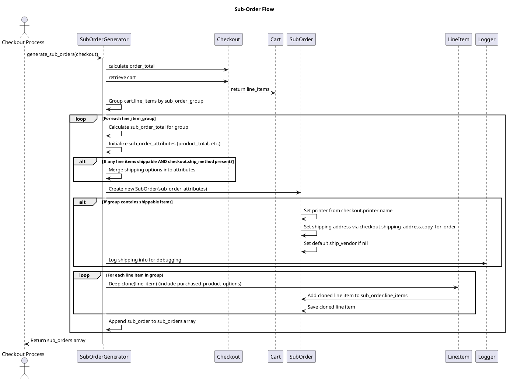

Order
=====

An order is the main model that represents a customer's purchase. It encapsulates all the details for processing an order—from initial creation and authorization through to shipment and completion. The Order model uses state management (via AASM) to handle various stages like :NEW, :AUTHORIZED, :PENDING, :SHIPPED, etc., and includes business logic for payment, shipping information, cancellations, and more.

The Order model is responsible for representing and managing a customer's purchase throughout its lifecycle. Its main responsibilities include:

State Management:
The order uses AASM to define states (e.g., :NEW, :AUTHORIZED, :PENDING, :PROCESSING, :SHIPPED, :COMPLETED) and provides events (like :auth_attempted, :captures_attempted, :cancelled) that transition the order between these states. Each transition can trigger business logic (like validating payments or adding shipping info).

Payment Handling:
The model tracks payment status through states such as :AUTHORIZED, :CAPTURED, or :CAPTURE_FAILED. It defines guards to ensure transactions succeed before moving forward or transitions to error states when payment issues arise.

Sub-order Coordination:
An order can contain multiple sub-orders. Some events (like :partial_acceptance_by_bookserve or :partial_cancellation) rely on the aggregated status of its sub-orders to determine the overall order state.

Shipping and Fulfillment:
When an order reaches the shipped state, it automatically adds shipping information and may perform further post-shipment processing, like marking the order as completed.

Business Logic Hooks:
After entering certain states (for example, after entering the :PENDING state), the order runs methods such as track_sales, auto_upgrade_to_rush_if_possible, and attempts printing for non-shippable items.

Distribution Channel Identification:
The order is aware of its originating channel (e.g., amazon, ingram, or blurb), which may affect how it is processed.

These responsibilities ensure that an order moves correctly through its lifecycle, integrating payment, fulfillment, and post-order processing according to the business rules in the Blurby application.

# Suborder
An order can be divided into multiple **sub-orders** where each sub-order represents a distinct grouping of items that may be processed or fulfilled differently. In Blurby, a sub order:
- Has its own state management (using AASM) for states like NEW, IN_HOLDING_BIN, PROCESSING, SHIPPED, etc.
- Contains related line items that identify which items are processed together.
- Manages its own shipping info and communication with external services (like BookServe).
- Coordinates transitions (e.g., moving to a holding bin, handling cancellations, or processing shipments) that impact its parent order.

This separation allows more granular control over order fulfillment and error handling for different types of products (shippable vs. digital, for example).

# Order Flows

## Order creation
How an Order is Created:

- The OrderGenerator#place_order method is the main entry point.
- It validates the checkout.
- In OrderGenerator#build_order, a new Order object is created with:
    * User, total pricing, currency details, billing/shipping info.
    * Payment information is set depending on the payment type (e.g., PayPal or credit card).
    * Tax, shipping, and discount values are assigned.
- OrderGenerator calls SubOrderGenerator.generate_sub_orders(checkout) to create sub-orders.
- These sub-orders are grouped based on line item types, each sub-order gets assigned:
    * Product totals, shipping options (if the items are shippable), printer/vendor details.
    * Duplicates of line items (using deep_clone) are added to the sub-order.
- Finally, the Order object is saved inside a transaction.

## Sub-orders Creation
The SubOrderGenerator.generate_sub_orders(checkout) method performs:
- Calculation of order totals.
- Grouping of cart line items by their sub_order_group.

For each group:
- It calculates the sub-order total specific to the group.
- Creates a new SubOrder with attributes (e.g., product_total).
- If any items are shippable and a shipping method is present, shipping options are merged into attributes.
- For shippable sub-orders, printer, shipping address, and vendor info are set.
- Each line item is cloned (with associated options) and added to the sub-order.

The method returns an array of sub-orders to be attached to the Order.

