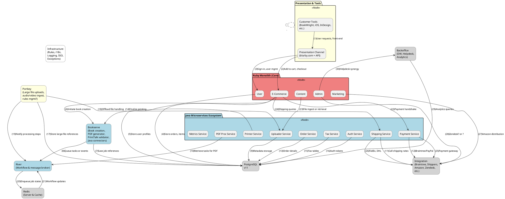
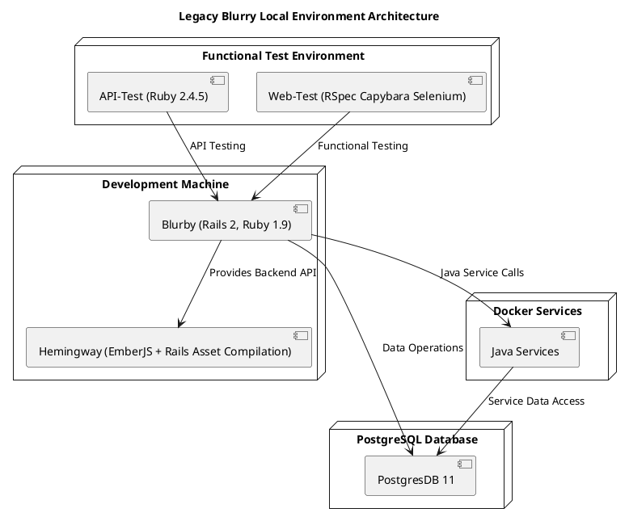

chromedriver: '133.0.6943.98'

This document serves as a guide for deployments and releases, covering essential aspects of local, test, and production environments. It addresses activities for both Ruby and Java services. As this is a living document, it will continue to evolve and bridge gaps over time as new changes are incrementally and progressively introduced to different services. Below is a summary of the services/repos already documented:

- Blurby
- Hemingway
- API tests
- Web tests

# Local environment architecture
Blurby is an ecosystem composed of a large monolith and several Java services. These services share the same database but use different schemas, allowing for the use of separate database instances.

The image below illustrates a simplified version of a full end-to-end workflow involving all the critical services within the Blurby ecosystem.

# Blurby - local development architecture
Blurby deployment pipelines are divided into two main environments: master and production. These will be discussed in detail in the upcoming chapters. To introduce changes into the main codebase and test them locally in a controlled manner, a hybrid approach is necessary. This document describes a setup involving a virtual machine and a dockerized environment. Below is a simple abstraction of the architecture you can deploy on your local machine, tested on the following configuration:

M3 Mac 36GB Sonoma 14.4
UTM - virtualizing an emulated Ubuntu 20.04 LTS x64
Podman



As mentioned earlier, Blurby operates in two primary environments: master and production. However, some services follow different branch distributions. Below is a verified mapping of these environments to their respective branches:

| Service   | Staging/Master | Integration/Production |
|-----------|----------------|------------------------|
| Blurby    | master         | production             |
| Hemingway | master         | production             |
| API-Test  | master         | master                 |
| Web-Test  | master         | production             |

# Local environment installation

## Mac
To set up a minimal and stable local environment, you need to install the following tools:

1. **Podman** - A containerization tool similar to Docker.
2. **UTM** - A virtualization system with architecture emulation capabilities.
3. **Homebrew (brew)** - A package manager for macOS.
4. **rbenv** - A Ruby version manager.

The latest hardware configuration tested is the following:

**OS** Mac M3 Pro Sonoma 14.4 36 GB
**Podman** 5.3.2
**VM machine** UTM Version 4.6.4 (107)

### Common setup
Here we are going to install the necessary libraries and tools:

1. **Podman**: Follow the installation instructions [here](https://podman-desktop.io/docs/installation/macos-install).
2. **UTM**: Follow the installation instructions [here](https://mac.getutm.app/).
  a. download the pre-built machine from here - Ubuntu 20.04
3. **Homebrew (brew)**: Follow the installation instructions [here](https://www.digitalocean.com/community/tutorials/how-to-install-and-use-homebrew-on-macos).
4. **rbenv**: Follow the instructions below:

```sh
$ brew install rbenv
```

Ensure your shell's run commands file includes the following:

```sh
# ~/.zshrc

# Ruby and Brew
eval "$(/opt/homebrew/bin/brew shellenv)"

export PATH="$HOME/.rbenv/shims:$PATH"
eval "$(rbenv init -)"
```

### Capistrano installation
Capistrano, available at [Capistrano GitHub](https://github.com/capistrano/capistrano), will be used locally to automate simple scripts, helping you manage deployment tasks more efficiently in your local environment.

Install Ruby latest version (3.4.1) (date: 20250221)
```
rbenv install 3.4.1
rbenv global 3.4.1
```

Install capistrano
```
gem install capistrano -v 3.19.2
```

## Cloning Repositories

### Docker microservices
```
git clone git@github.com:blurb/docker_microservices.git
cd docker_microservices
git checkout utm-focal
podman compose up
```

### Blurby local deployment
```
git clone git@github.com:blurb/blurby-utm.git
cd blurby-utm
bundle install
cap utm deploy
```

create a SSH key to add to blurb GtiHub Repo
```bash
ssh-keygen -t ed25519 -C "ubuntu20-amd64@blurb.com"
cp ~/.ssh/id_ed25519.pub /mnt/utm
```
after that copy the pub key available in your shared folder in the host and configure it into you GitHub account

add your ssh key as default (again)
```bash
eval "$(ssh-agent -s)"
ssh-add ~/.ssh/id_ed25519
```

Edit the `/etc/hosts` and add the VM's IP to your host (you found it by using `ifconfig`), verify the content was added especially the IP that was assigned to the UTM virtual machine
```bash
echo "192.168.64.4 utm-focal-blurby" | sudo tee -a /etc/hosts
echo "192.168.64.4 dev.blurb.com" | sudo tee -a /etc/hosts
```

Add the configuration to the your host SSH config
```bash
cat <<EOF >> ~/.ssh/config
Host utm-focal-blurby
  HostName utm-focal-blurby
  User rpi
  IdentityFile ~/.ssh/id_rsa
EOF
```

### Running the local server
for running the server
```sh
ssh utm-focal-blurby
cd code/blurby
bundle exec thin start
```

for running the console
```
ssh utm-focal-blurby
cd code/blurby
bundle exec script/console
```

### IDE capabilities
You could use VS Code as your editor to leverage features such as linters, remote connections, GitHub integration, and GitHub Copilot. Here is a list of recommended extensions:

- aliariff.vscode-erb-beautify
- andycui.vscode-log-viewer-gb2312
- castwide.solargraph
- dbaeumer.vscode-eslint
- donjayamanne.githistory
- george3447.docker-run
- github.copilot
- github.copilot-chat
- github.github-vscode-theme
- github.remotehub
- github.vscode-github-actions
- intellsmi.comment-translate
- jebbs.plantuml
- koichisasada.vscode-rdbg
- ms-azuretools.vscode-docker
- ms-python.debugpy
- ms-python.python
- ms-python.vscode-pylance
- ms-vscode-remote.remote-containers
- ms-vscode-remote.remote-ssh
- ms-vscode-remote.remote-ssh-edit
- ms-vscode-remote.remote-wsl
- ms-vscode-remote.vscode-remote-extensionpack
- ms-vscode.azure-repos
- ms-vscode.remote-explorer
- ms-vscode.remote-repositories
- ms-vscode.remote-server
- ms-vscode.vscode-speech
- openai.openai-chatgpt-adhoc
- redhat.java
- robconery.pg-chat
- solomonkinard.git-blame
- stuart.unique-window-colors
- vayan.haml
- vscjava.vscode-gradle
- vscjava.vscode-java-debug
- vscjava.vscode-java-dependency
- vscjava.vscode-java-pack
- vscjava.vscode-java-test
- vscjava.vscode-maven