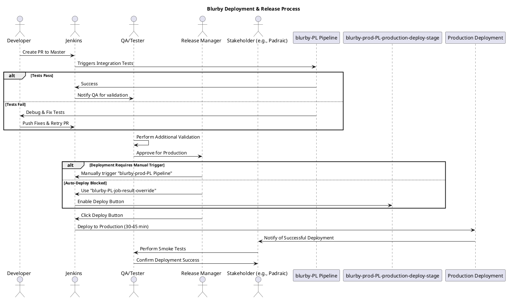

# Blurby Deploy

## Key Steps in the Release Process:
1. **Run Tests Locally**
   - Ensure tests pass locally before running them in the pipeline.
   - Flaky tests can be difficult to debug due to looping structures and waiting mechanisms.

2. **PR to Master Triggers the Pipeline**
   - follow these conventions https://blurb-books.atlassian.net/wiki/spaces/SE/pages/3700523019/Pull+Request+-+Template
   - Merging to **master** automatically triggers the **blurby-PL pipeline** http://jenkins-pdx.blurb.com/view/blurby-PL/.
   - This pipeline runs **integration tests** before allowing further progression.

3. **Handling Long Running Tests & Flakiness**
   - Some tests introduce long delays due to **external service dependencies** (payments, shipping).
   - Excessive retries (e.g., 100-200 seconds) can extend test execution to **several hours**.
   - Consider restructuring test scenarios to reduce unnecessary redundancy.

4. **Manual Intervention for Production Deployment**
   - Even if all tests pass, **a manual step is required** to trigger the production deployment using the the **blurby-prod-PL pipeline** http://jenkins-pdx.blurb.com/view/blurby-prod-PL/.
   - A workaround (forcing tests to pass) is sometimes used to enable the final **deploy button** using blurby-prod-PL-production-deploy-stage this is by using the blurby-PL-job-result-override, that allows to override the rule that an upstream job needs to start, this deployment process is executed via **Jenkins**, requiring selection of the correct **blurby-prod-PL-test-stage** http://jenkins-pdx.blurb.com/view/all/job/blurby-PL-job-result-override/.

5. **Production Deployment & Post-Deploy Validation**
   - Once the button is clicked, deployment is typically **quick (30-45 minutes)**.
   - After deployment, perform **smoke tests** to verify functionality.
   - Certain stakeholders (e.g., Padraic) actively monitor production changes.

#### **Insights & Considerations:**
- **Flaky Tests Need Attention:**
  - Test delays caused by waiting for external services lead to inconsistency.
  - A better approach to handling asynchronous operations is needed.
  - Redundant tests could be merged into **one scenario** without losing coverage.

- **Branching & Pipeline Structure:**
  - **Master is now equal to Production**, eliminating the need for cherry-picking changes.
  - The team should document best practices regarding testing in **master vs. production**.
  - Master can serve as a **sandbox environment** for isolated testing.

- **Pipeline Dependencies & DevOps Challenges:**
  - DevOps ownership of deployments is unclear, with only **Tom** having deep knowledge.
  - Issues with **River, Redis, and networking** sometimes require **manual fixes** and after them do not forget re-deply the service impacted using the Jenkins pipeline.
  - Certain tests pull from **master instead of production**, which can cause inconsistencies.

- **Improving Deployment Process:**
  - More **lead time is needed for deployments**, ideally planned **one week in advance**.
  - Avoid deploying on **Fridays or late in the week** to prevent weekend incidents.
  - The AWS instance could be an alternative sandbox, but it's not fully functional yet.

