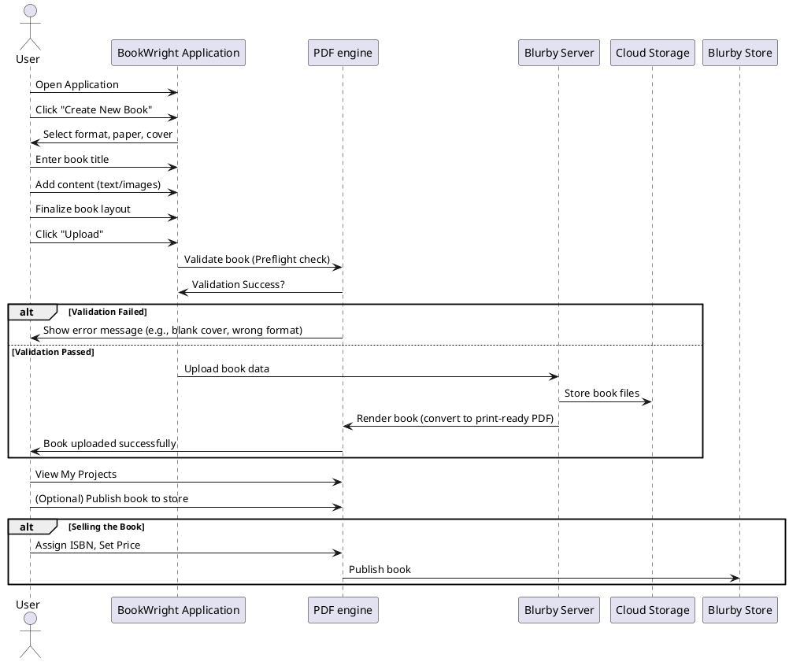
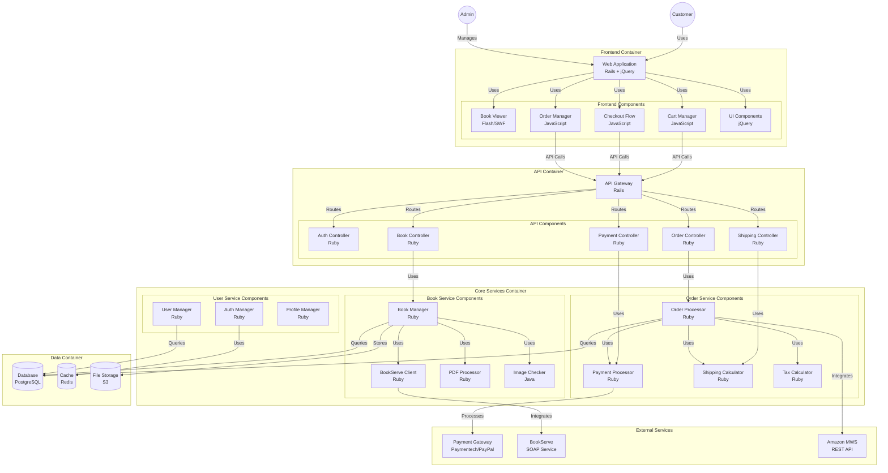
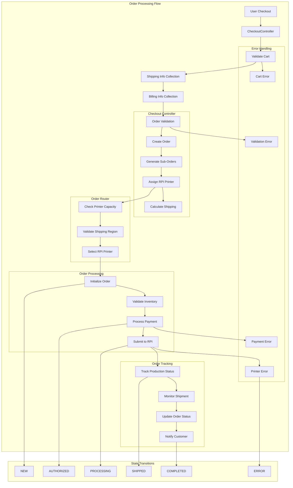

# Porduct option types
+---------------------------+
| type                      |
|---------------------------|
| EndsheetType              |
| PaperBaseType             |
| PhotoBookEndsheetGroup    |
| TradeBookCoveringGroup    |
| PremiumPaper              |
| BookCoveringType          |
| PremiumWorkflow           |
| PlusCoating               |
| CornerType                |
| StandardCoating           |
| PrintableProductDimension |
| BlurbBookCoveringGroup    |
| FinishType                |
| PremiumPlusCoating        |
| PhotoBookPaperGroup       |
| CoverType                 |
| CoatingType               |
| GiftCardCombo             |
| ProBookCoveringGroup      |
| PaperType                 |
| HangingHardwareType       |
| CustomCoverOption         |
| NovelPaperGroup           |
| ProEndsheetGroup          |
| Colophon                  |
| LargeBookCoverGroup       |
| CoverPaperType            |
| GroupAllProductOption     |
+---------------------------+
# Book Types
https://blurb-books.atlassian.net/wiki/spaces/TEC/pages/1375240373/Product+Options+Naming+Conventions

Blurb book types are used to identify the size and layout of the book. The following are standard names for blurb book types (Note: api calls use the book_type string)

| book_type parameter         | Format              | Approximate Trim Size (inches) | Bleed Page Size (points) | Bleed Page Size (pixels) |
|-----------------------------|------------------------|------------|---------|-----------|
| standard_landscape          | Standard landscape     | 10x8       | 693x594 | 2888x2475 |
| standard_portrait           | Standard portrait (deprecated - archive only) | 7.75x9.75  | 567x720 | 2363x3000 |
| standard_portrait_true8x10  | Standard portrait      | 8x10       | 585x738 | 2438x3075 |
| square                      | Small square           | 7x7        | 495x495 | 2063x2063 |
| large_square                | Large square           | 12x12      | 855x864 | 3563x3600 |
| large_landscape             | Large format landscape | 13x11      | 909x783 | 3788x3263 |
| pocket                      | Pocket text books      | 5x8        | 369x594 | 1538x2475 |
| trade                       | Trade books            | 6x9        | 441x666 | 1838x2775 |
| letter                      | Letter format          | 8.5x11     | 621x810 | 2588x3375 |

## Size

The specified size in the table above is a full-bleed size.  When producing the book, the bleed is trimmed off, leaving the page at its final trimmed size.  In order to allow for imperfections in the trim process, it is recommended that any content that extends to the trim edge should flow all the way to the full bleed size.  Pages of a book have a standard 1/8" inch bleed on the top, bottom and outer edge of the page.  As page 1 (and all odd pages) are on the right-hand side, the bleed is on the right-hand side, vis-a-vis page 2 (and all even pages) have bleed on the left-hand side.

1/8" is 9 points and 38 pixels

# Cover Paper Types

The following cover paper types are supported -

| cover_paper_type parameter |
|----------------------------|
| plus_cover                 |
| self_cover                 |
| premium_plus_cover         |

# Cover Sizes

The cover size depends on the cover type and the trim size of the book.

| book_type parameter        | Approximate Trim Size (inches) | Cover Type | Page Bleed Size (points) | Cover Bleed Size (points) | Cover Bleed Size (pixels) |
|----------------------------|------------|-------------|---------|---------|-----------|
| small_square               | 5x5        | Softcover   | 369x378 | 369x378 | 1538x1575 |
| square                     | 7x7        | Softcover   | 495x495 | 495x495 | 2063x2063 |
| square                     | 7x7        | Dustjacket | 495x495 | 525x513 | 2188x2138 |
| square                     | 7x7        | Imagewrap   | 495x495 | 525x549 | 2188x2288 |
| standard_portrait_true8x10 | 8x10       | Softcover   | 585x738 | 585x738 | 2438x3075 |
| standard_portrait_true8x10 | 8x10       | Dustjacket | 585x738 | 612x756 | 2550x3150 |
| standard_portrait_true8x10 | 8x10       | Imagewrap   | 585x738 | 616x791 | 2567x3296 |

## Softcover

Softcover books have a cover the matches the size of the pages.  The cover will also include the standard 1/8" bleed on the edges of the cover.  When sending a front_cover or back_cover image, you should use the same full bleed dimensions as the trim size.  The front_cover will with have the bleed trimmed off on the right edge, and the back_cover will have it trimmed on the left edge

## Imagewrap

Imagewrap books are standard hard cover books.  The cover is 1/8" larger than the pages (the overhang) and it wraps around the top, bottom and side edges of the cover board, so a larger bleed (22.5 pts) is needed.  See the above table for full bleed cover sizes for some common trim sizes.

## Dustjacket

Dustjacket books have a hard cover with a separate glossy finish paper cover that wraps around the cover board and spine and includes flaps.  When sending individual images for the front and back cover, the full bleed size will wrap slight around the edge of the cover, but you must specify separate content for the front and back flap.  See the above table for full bleed cover sizes for some common trim sizes.

# Cover Types

The following cover types are supported -

| Cover type | Description |
|------------|-------------|
| softcover | Softcover with glossy finish and no flaps |
| dustjacket |  Hardcover, dustjacket with glossy finish and inside flaps on the cover |
| imagewrap | Hardcover, imagewrap with matte finish and no flaps |
| saddle | Saddle-stitched (magazine style binding) |

# Endsheet Types

The following endsheet types are supported -

| endsheet_type parameter     | Color       | Finish   | US Weight |
|-----------------------------|-------------|----------|-----------|
| standard_mid_grey_endsheet  | Pearl       | Antique  | 80        |
| pro_white_endsheet          | Kraft White | Antique  | 80        |
| pro_charcoal_endsheet       | Charcoal    | Antique  | 80        |
| pro_light_grey_endsheet     | Cape Cod    | Antique  | 80        |
| pro_black_endsheet          | Black       | Antique  | 80        |

# Linen Types

The following linen types are supported -

| linen_type parameter          | Description              | Color     | Stock Tp| Brand            |
|-------------------------------|--------------------------|-----------|---------|------------------|
| standard_black_linen_covering | Standard black linen     | Black     | Cloth   | Arrestox B-Cloth |
| standard_grey_linen_covering  | Standard grey  linen     | Grey      | Cloth   | Arrestox B-Cloth |
| pro_charcoal_linen_covering   | Pro Charcoal             | Gun Metal | Cloth   | Verona           |
| pro_oatmeal_linen_covering    | Pro Oatmeal              | Oatmeal   | Cloth   | Cot-Linen        |

## Paper Types

There are four main types of paper options for your books

* 5 types of photo book papers
* 5 types of trade papers (used for books meant for distribution, currently pocket, trade and standard_portrait_true8x10 book_types)
* 3 types of magazine paper
* 2 types of text papers used for legacy pocket and trade books
These are legacy papers types, meant for text books (although they can contain images too) and should no longer be used.

| paper type | description | book types valid for  |
|------------|-------------|-----------------------|
| standard_paper | Standard paper | all non-text books |
| premium_matte_paper | Premium paper (matte finish) | all non-text books |
| premium_lustre_paper | Premium paper (glossy finish) | all non-text books |
| pro_medium_gloss_paper | Proline Pearl Photo paper | all non-text books |
| pro_uncoated_paper | Proline uncoated paper | all non-text books |
|                    |                        |                    |
| standard_trade_matte_paper | Standard trade paper (on white uncoated paper) | trade books |
| standard_trade_bw_matte_paper | Standard trade paper (on white uncoated paper) | trade books |
| economy_trade_matte_paper | Economy trade paper (on white uncoated paper) | trade books |
| economy_trade_bw_matte_paper | Economy trade black and white paper (on white uncoated paper) | trade books |
| economy_trade_bw_cream_matte_paper | Economy trade black and white paper (on cream uncoated paper) | trade books |
|               |                                                 |                        |
| bw_text_paper | Black and white paper (on cream uncoated paper) | legacy text books only |
| color_text_paper | Color paper (on white uncoated paper) | legacy text books only |
|               |                                                 |                        |
| velvet_paper | Paper used for premium magazines printed on Indigo press | paper used for premium magazines printed on Indigo press |
| magazine_paper | Paper for standard inkjet magazine | paper for standard inkjet magazine |
| premium_magazine_paper | only used for Samsung magazines | only used for Samsung magazines |
| standard_layflat_paper | Layflat paper | all non-text books (not magazine, legacy text, or trade) |

# How to create a Book
Creating a book involves several steps, and the process can vary depending on the tools and methods you choose to use. Here's a general guide to creating a book using a tool like BookWright:
1. Start the Book Creation Process:
Open BookWright and click on "Create" to start a new book project.
Choose the type of book you want to create, such as a photo book, trade book, or magazine.
2. Select Book Specifications:
Choose the format, paper type, and cover type for your book.
Give your book a title and set up the project.
3. Design Your Book:
Use the layout tools to arrange text and images on each page.
Add photos by importing them from your computer.
Customize the design with different layouts, backgrounds, and text styles.
4. Add Metadata:
Include important metadata such as the author name, ISBN (if applicable), and any logos or branding.
5. Preview and Edit:
Use the preview function to see how your book will look when printed.
Make any necessary edits to ensure everything is correct and visually appealing.
6. Upload and Order:
Once satisfied with your design, upload the book to the platform's server.
Follow the prompts to order a printed copy or set it up for sale online.
7. Finalize and Publish:
Complete the checkout process to order your book.
If selling, set up the book for sale on the platform's marketplace.
This process can be repeated for each book you wish to create. Tools like BookWright provide a user-friendly interface to help you design and publish your book efficiently

# Products - bookserve
https://www.blurb.com/b/12351820-huwarra-watercolors
https://www.blurb.com/admin/product/swearch/show/12351820

# Orders with Addons
https://www.blurb.com/admin/support/orders/order_detail/3443157

proposed SKU
https://blurb-books.atlassian.net/wiki/spaces/TEC/pages/82542644/SKU
https://blurb-books.atlassian.net/wiki/spaces/PROD/pages/1304821761/Product+Papertype+Specs

Printalk E2E
- https://blurb-books.atlassian.net/wiki/spaces/TEC/pages/505643018/PrintTalk+End+To+End
- https://blurb-books.atlassian.net/wiki/spaces/TEC/pages/328138781/PrintTalk

Spikes
- https://blurb-books.atlassian.net/wiki/spaces/TEC/pages/1272939049/Bookwizard+New+Photobook+Trim+Size+10X10
- https://blurb-books.atlassian.net/wiki/spaces/TEC/pages/1327464544/New+Coating+Type+for+imagewrap+covers+-+LAYFLAT
- https://blurb-books.atlassian.net/wiki/spaces/TEC/pages/1267925095/Bookwizard+New+Paper+Types+for+LayFlat
- https://blurb-books.atlassian.net/wiki/spaces/TEC/pages/745767777/Add+New+Printer

## Complete flow

