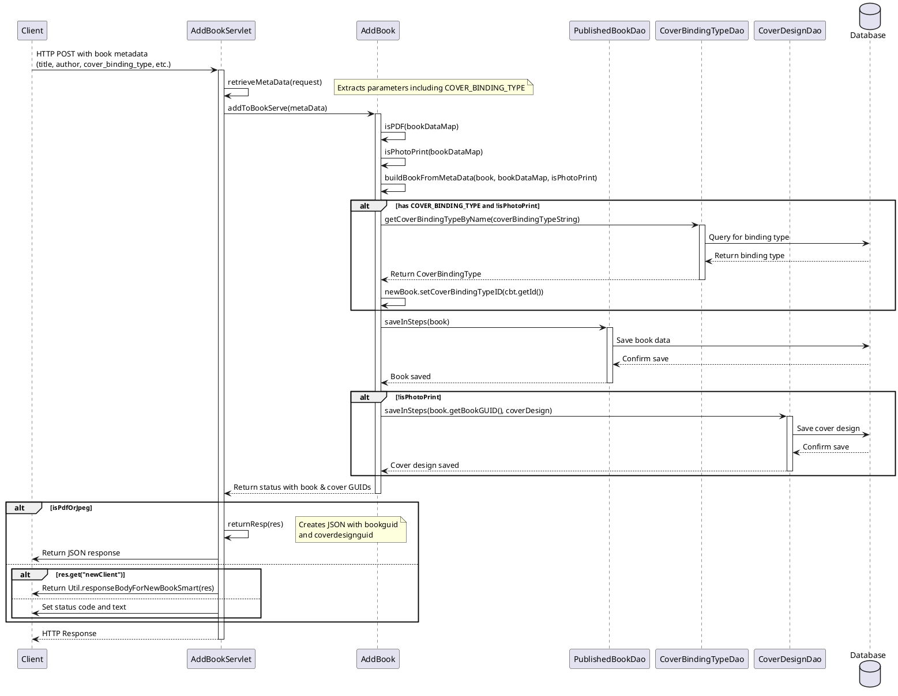
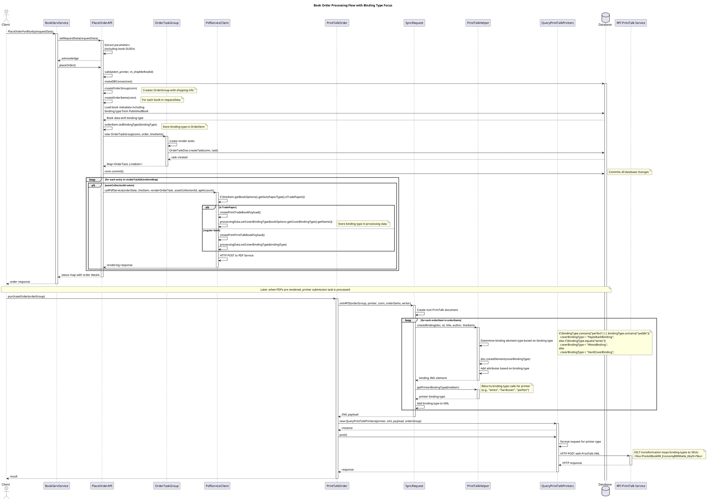

# AddBookServlet Flow Analysis with Focus on Cover Binding Types

The `AddBookServlet` is responsible for handling requests to add new books to Bookserve, with special handling for cover types and cover binding types. Here's a detailed flow:

## Main Flow

1. When a `POST` request is received:
   - The servlet collects all book metadata via `retrieveMetaData()`
   - It passes this metadata to `AddBook.addToBookServe()` to create the book
   - The response handling varies between PDF/JPEG books and BookSmart books

2. Cover-related parameters handling:
   - `COVER_BINDING_TYPE`: Extracted from request and stored in metadata map
   - For PDF books with "customEndSheet" parameter = "none", CUSTOMLOGO is set to "1"
   - `ASSET_COLLECTION_ID`: Can be specified for cover design

3. In `AddBook.addToBookServe()`:
   - Creates a `PublishedBook` and a `CoverDesign` object
   - Populates the book data via `buildBookFromMetaData()`
   - Sets the cover binding type via `CoverBindingTypeDao` if provided:
   ```java
   if (bookInfoData.containsKey(COVER_BINDING_TYPE) && !isPhotoPrint) {
       String coverBindingTypeString = bookInfoData.get(COVER_BINDING_TYPE).toString();
       if (!coverBindingTypeString.isEmpty()) {
           CoverBindingType cbt = new CoverBindingTypeDao().getCoverBindingTypeByName(coverBindingTypeString);
           if (cbt != null) {
               newBook.setCoverBindingTypeID(cbt.getId());
           }
       }
   }
   ```
   - Saves the book with `PublishedBookDao`
   - Saves the cover design with `CoverDesignDao`

4. Response Handling:
   - For PDF/JPEG books: Returns JSON with book GUID and cover design GUID
   - For BookSmart books: Either returns formatted response or sets status code

## PlantUML Diagram



## Key Notes:
1. Cover binding type is only processed for non-PhotoPrint books
2. If the cover binding type is not found by name in the database, an error is logged but processing continues
3. For PhotoPrint books, the cover design is not saved
4. The response format differs based on whether it's a PDF/JPEG book or a BookSmart book
5. The `ASSET_COLLECTION_ID` parameter can be used to associate an existing asset collection with the cover design

This servlet acts as the entry point for adding books to the Bookserve system, handling various book types with appropriate metadata and covers.

# Detailed Order Flow with Focus on Cover Binding Types

When placing an order with a specific binding type (like "wireo"), the flow involves multiple components from order placement to XML generation to print command execution. Here's the detailed flow:

## Order Placement Flow

1. **Client calls PlaceOrderForBlurby in BookServService**
   - The client must provide existing book GUIDs created previously
   - These books already have binding types stored in the database

2. **PlaceOrderAPI handles the order creation logic**
   - Creates database transactions for order group, items, and tasks
   - Captures binding type from existing book data

3. **PDF Generation is triggered for each book**
   - `PdfServiceClient` selects appropriate processing method based on book type
   - Binding type is included in the payload sent to PDF service

4. **Order tasks are created and tracked**
   - When PDFs are rendered, a task for printer submission is created

5. **PrintTalk XML is generated**
   - `PrintTalkHelper` creates the XML with binding-specific elements
   - Special elements are created based on binding type

6. **XML is sent to the print vendor**
   - `QueryPrintTalkPrinters` sends the XML to the print vendor's API
   - The binding type affects SKU generation in the XSLT transformation

## Binding Type Processing Details

The binding type affects several critical points in this flow:

1. **In PlaceOrderAPI**: The binding type from the book record is stored in the OrderItem
2. **In PdfServiceClient**: The binding type affects PDF generation parameters
3. **In PrintTalkHelper**: The binding type determines XML structure and elements
4. **In XSLT transformation**: The binding type is mapped to specific product SKUs

## PlantUML Sequence Diagram



## Key Points About Binding Types in the Flow

1. **Database Storage**:
   - Book's binding type is stored in `PublishedBook.coverBindingTypeID`
   - When creating an order, this value is loaded and stored in `OrderItem.bindingType`

2. **PDF Generation**:
   - For tradebooks: `PrintTradeBookProcessingData.setCoverBindingType(bindingType)`
   - For regular books: `PrintTalkProcessingData.setCoverBindingType(bindingType)`

3. **XML Generation**:
   - In `PrintTalkHelper.createBinding()`, binding type determines:
     - XML element type (HardCoverBinding, PaperBackBinding, WireoBinding)
     - Element attributes and child elements

4. **Printer Communication**:
   - `PrintTalkHelper.getPrinterBindingType()` returns the binding code for the printer
   - XSLT transforms binding type to specific SKU formats:
     - Example: "wireo" + tradebook paper becomes "PocketBookWireo_EconomyBWMatte_6by9"

Adding support for tradebook with wireo binding would require ensuring all these components correctly handle this specific combination, with special attention to the XML generation and RPI's XSLT transformation.