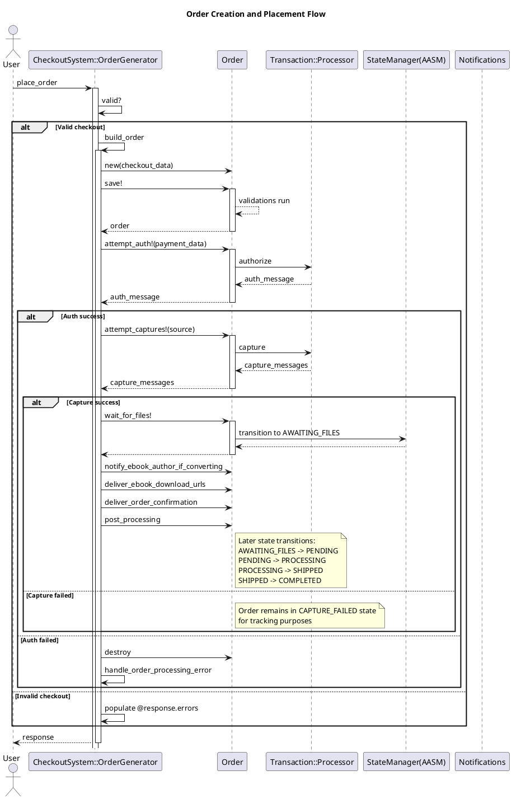
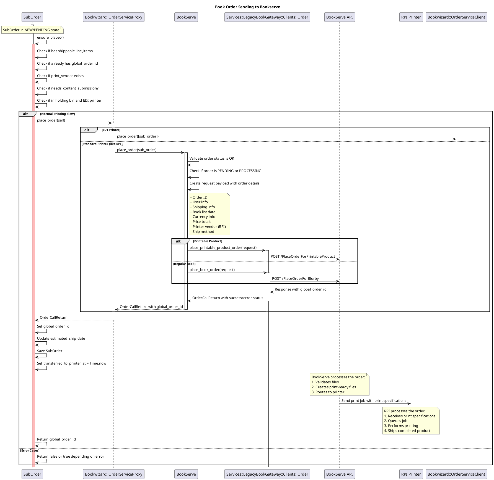
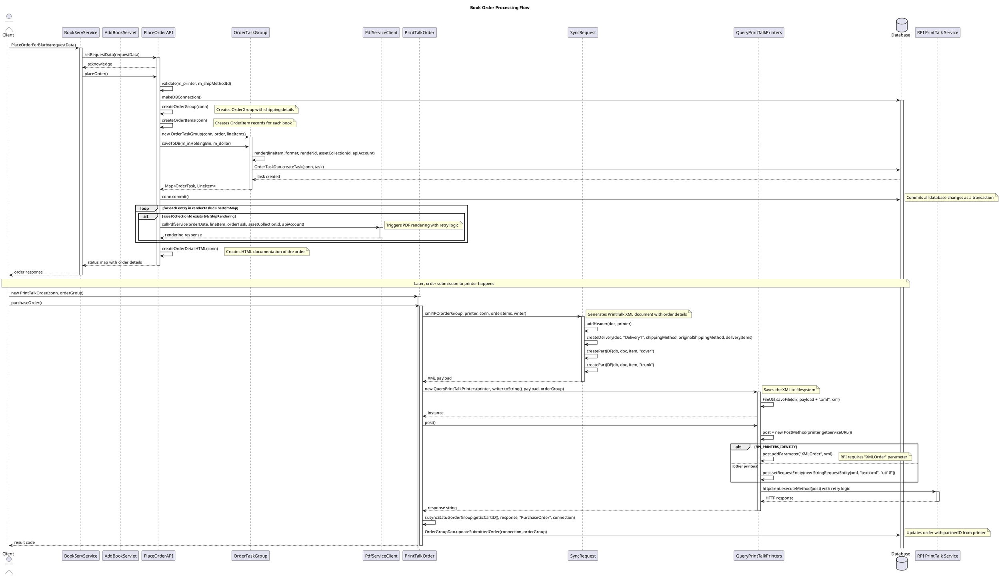

# Order lifecyle
There are several processes happening before, around, and after save:

## Before Save
- **Validations**: The model validates inclusion of status and payment_type, and requires presence of currency and order_internal_type

## Around Save
- **State Machine (AASM)**: The core of this model's behavior is its state machine
- No explicit ActiveRecord around_save callbacks, but the state transitions contain logic that runs before/after state changes

## After State Changes (which often trigger saves)
- **State transition after_enter hooks**: Many state transitions have after_enter callbacks
- For example, when an order enters PENDING state, it:
  ```ruby
  state :PENDING, :after_enter => Proc.new {|o|
    o.track_sales
    o.auto_upgrade_to_rush_if_possible
    # Additional logic to handle non-shippable items
  }
  ```
- SHIPPED state triggers

add_shipping_info

 then calls

completed!


- COMPLETED state processes all line items with

post_order_completed

## Manual Save Calls
- Several methods explicitly call

save!

 after changing state:
  -

ok!

 method calls save! after changing status
  -

error!

 method calls save! after setting status to ERROR
  -

add_shipping_info

 sets shipping date then calls save!

The model doesn't use traditional ActiveRecord callbacks like before_save/after_save, instead relying on the AASM state machine for lifecycle management with validations for data integrity.

# Complete Order Creation and Placement Flow

Here's how the order creation process works from start to finish:

## 1. Order Generation Begins
```ruby
# OrderGenerator receives checkout data and initiates the process
generator = CheckoutSystem::OrderGenerator.new(checkout, remote_ip, payment_method)
response = generator.place_order
```

## 2. Order Building Phase
```ruby
# Inside place_order, if validations pass:
Order.transaction do
  order = build_order  # Creates Order object with all attributes
  order.save!          # Triggers validations
end
```

The

build_order

 method:
- Creates a new Order
- Sets user, total, currency, and other basic attributes
- Adds coupon uses from checkout
- Sets billing/shipping addresses
- Sets tax, shipping costs
- Creates sub_orders for different line item types

## 3. Payment Processing
```ruby
# After successful save, attempt payment authorization
auth_message = order.attempt_auth!(...)
if auth_message.success?
  # Attempt to capture the payment
  capture_messages = order.attempt_captures!(...)
  if captures_successful?
    # Continue with order processing
  end
else
  # Auth failed - destroy order and report error
  order.destroy
end
```

## 4. State Transitions
If payment succeeds, the order moves through the AASM state machine:
1. **NEW** (initial state)
2. **AUTHORIZED** (after successful auth)
3. **CAPTURED** (after successful capture)
4. **AWAITING_FILES** (called explicitly after capture)
   -

wait_for_files!

 transitions here
   -

try_move_awaiting_to_pending

 checks if files are ready

## 5. Post-Payment Processing
```ruby
# In OrderGenerator#place_order after successful captures:
order.wait_for_files!
order.notify_ebook_author_if_converting
order.deliver_ebook_download_urls
order.deliver_order_confirmation
```

## 6. Later State Transitions
The order will continue through more states based on fulfillment:
- **PENDING** → When files are ready for processing
- **PROCESSING** → When sent to printer/fulfillment
- **SHIPPED** → When physical items are shipped
- **COMPLETED** → Final state after shipping

Each state has callbacks that may:
- Send notifications
- Update tracking information
- Process inventory changes
- Record sales data

The AASM state machine is the central controller of the order's lifecycle, with various callbacks running before, during, and after each state change.



# Order Processing Flow for Printables with RPI as Printer

flow of how printable items get sent to the printer, specifically focusing on RPI.

## Order Creation and Initial Processing

1. When a checkout is completed, `OrderGenerator` handles creating the order:
   - Payment authorization via

order.attempt_auth!

   - Payment capture via

order.attempt_captures!

   - The order transitions to `AWAITING_FILES` via

order.wait_for_files!

   - Order confirmations are delivered via

order.deliver_order_confirmation

2. The `SubOrderGenerator` creates sub-orders during checkout:
   ```ruby
   sub_order.print_vendor = checkout.printer.name
   ```

## Transition to Print Processing

3. The `Order.process_pending_orders` method is called periodically (every 10 minutes) by a river workflow to process orders in PENDING state:
   ```ruby
   find(:all,
     :include => [:sub_orders],
     :conditions => ["orders.status = 'OK' and orders.state = 'PENDING' and ((orders.created_at < (now() - (interval '3 hours'))) or orders.internal_type_id = ? or orders.api_key_id = ?)",,],
     :order => 'orders.id'
   )
   ```

4. This triggers `attempt_printing!` on each sub-order.

## Sending to RPI (PrinterServer)

5. In the `SubOrder` class, the `attempt_printing` event has multiple transitions:
   ```ruby
   transitions :from => [:NEW], :to => :SUBMITTING_CONTENT,
               :guard => lambda { !place_in_holding_bin? && needs_content_submission? }

   transitions :from => [:NEW, :ERROR], :to => :IN_HOLDING_BIN,
               :guard => lambda { place_in_holding_bin? && at_printer? }

   transitions :from => [:NEW, :ERROR], :to => :PROCESSING,
               :guard => lambda { ( !contains_shippable_line_items? || at_printer? ) && !needs_content_submission? }
   ```

6. When transitioning to `PROCESSING`, the `post_processing` method is called which:
   ```ruby
   def post_processing
     ensure_placed if edi_printer?
     set_contractual_ship_date!
     self.transferred_to_printer_at = Time.now
     save
     # ...
   end
   ```

7. For non-EDI printers like RPI, the actual sending to printer happens via `ensure_placed`:
   ```ruby
   def ensure_placed
     # ...
     order_response = @@order_service_proxy.place_order(self)
     if order_response.success?
       self.global_order_id = order_response.global_order_id
       # ...
     end
     # ...
   end
   ```

8. The `place_order` method in `order_service_proxy` determines whether to use BookServe (for standard printers like RPI) or BookWizard (for EDI printers):
   ```ruby
   def place_order(sub_order)
     if (sub_order.edi_printer?)
       @@bookwizard.place_order([sub_order])
     else
       @@bookserve.place_order(sub_order)
     end
   end
   ```

## Holding Bin Rules

Orders might go to a holding bin before printing based on different rules. Orders in the holding bin need to be released (either automatically or manually) before they continue to printing.

## RPI-Specific Logic

There are some special cases for RPI:

1. Rush handling is available for RPI orders in the US with specific trim sizes:
   ```ruby
   def qualifies_for_rush?
     return false unless self.print_vendor == "RPI"
     # Additional conditions...
   end
   ```

2. For Amazon orders, RPI appears to be the default printer unless it's a pick-and-pack (PNP) order:
   ```ruby
   def printer(amazon_order)
     if pnp_order?(amazon_order)
       nil  # let order router determine printer
     else
       Printer.find_by_name('RPI')
     end
   end
   ```

The order will get a `global_order_id` when successfully submitted to BookServe, and its status will be tracked through various state transitions until it's eventually shipped.



## Key points in this flow:
1. SubOrder.ensure_placed() performs several validations before attempting to place the order:
  - Checks if the order has shippable items
  - Verifies if it already has a global_order_id
  - Confirms if a print vendor is assigned
  - Checks if content submission is required
  - Determines if it should be in holding bin (for EDI printers)

2. OrderServiceProxy acts as a router determining where to send the order:
  - EDI printers are handled by BookWizard
  - Standard printers (including RPI) are handled by BookServe

3. BookServe prepares the payload with order details:
  - Customer information
  - Shipping details
  - Line items/products
  - Printer information (RPI)
  - Currency and pricing information
  - Shipping method

4. The REST client sends the appropriate request:
  - /PlaceOrderForBlurby for regular books
  - /PlaceOrderForPrintableProduct for printable products

5. BookServe API processes the order and routes it to RPI, where it's queued for printing

6. After successful submission, the global_order_id is stored on the SubOrder and can be used for tracking the order status

# Bookserve processing
The command to print to RPI (or any print vendor) is not directly sent from the PlaceOrderAPI class. Instead, this class sets up the order data in the database and triggers PDF rendering, but the actual print command happens later in the workflow.

The actual communication with print vendors happens through the `PrintTalkOrder` class, which uses PrintTalk XML protocol to submit orders to print vendors. Here's the flow:

1. In `PlaceOrderAPI.placeOrder()`, the method:
- Creates database records (order group, order items, order tasks)
- Triggers PDF generation via `PdfServiceClient` for rendering
- Creates documentation and metadata

2. Later, a separate process (triggered by a task processor) handles the actual print vendor communication:
- The `PrintTalkOrder.purchaseOrder()` method creates a PrintTalk XML document
- It sends this XML to the printer using QueryPrintTalkPrinters.post()
- The HTTP request is sent to the print vendor's service URL (configured in the database)
- The communication with RPI would use their service endpoint (something like http://uos.rpiprint.com/uossoap/uos_soap.asmx/SubmitRequest based on the migration files in the codebase).

This separation of concerns allows the order placement to happen quickly while the more time-consuming processes of PDF rendering and printer communication happen asynchronously.

