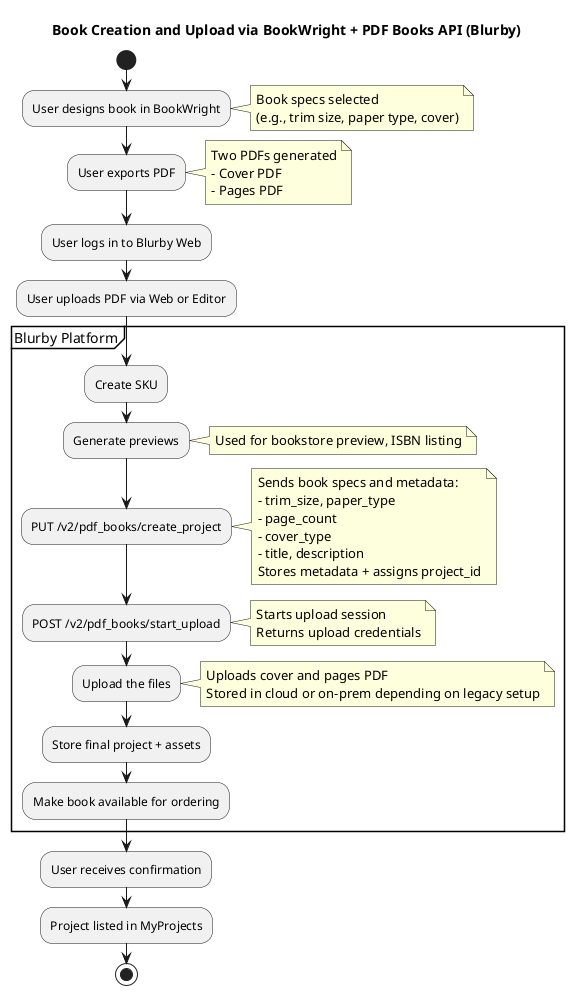

# SUSENG-38 : Provide Cover Preview Images that are Social-Media-Site-Compliant (Facebook+) And Make the Embeds Happy

Allow to share link following open graph or similar to support facebook, Instagram, Linkedin, and X (twitter). Bookserve asset books and pdf processing asset books are different so a solution would have to be implemented in two places to cover both bookwright and the pdf-processing-service
("email, facebook, twitter" are the options we offer on the dashboard)

---

## ✳️ **Goal**
Enable Open Graph-compliant metadata and preview cover images for sharing links on:
- Facebook
- Instagram
- LinkedIn
- X (Twitter)

Support needed in **both**:
- `bookserve` (BookWright flow)
- `pdf-processing-service` (PDF upload flow)

Targeting functionality via “Share” options on the dashboard.

---

## 🧠 **Key Considerations**
- 📚 **Two creation flows** = duplicated effort: PDF uploader vs BookWright
- 🖼️ **Dynamic Image Generation**: likely need a thumbnail or static preview image of the book cover (possibly the first page).
- 🔗 **Embed Metadata**:
  - Title (`og:title`)
  - Description (`og:description`)
  - Image (`og:image`)
  - URL (`og:url`)
  - Possibly fallbacks (`twitter:card`, etc.)
- 🌐 **NGINX** or Rails middleware may need updates to serve proper metadata per book.
- ⚠️ **SEO and Compliance** for image formats and sizing (per platform)
- 📁 **Hosting** of preview images (probably S3 or internal image CDN)
- 🔒 **Permissions**: only for public books
- 🧪 Need to test real previews via Facebook Debugger, LinkedIn Post Inspector, etc.

---

## ⛓️ **Dependencies**
- Legacy Rails 2 app (Blurby): Open Graph tags likely need to be injected via views or controller logic
- S3 or internal service for cover image generation/hosting (used in Hemingway?)
- Static page caching or NGINX may require configuration to allow OG metadata per-request
- Distribution/publication settings (visibility toggles)

---

## ✅ **Acceptance Criteria**
- [ ] When a user shares a public book link on Facebook/X/LinkedIn/Instagram:
   - A valid preview (cover image + title/description) is shown
- [ ] Book preview images are hosted and publicly accessible
- [ ] Both BookWright and PDF-upload flows support proper OG meta generation
- [ ] Test coverage for share metadata generation
- [ ] Visibility and permissions respected (no previews for private books)
- [ ] SEO validation passes on Facebook Debugger & Twitter Card Validator
- [ ] Links shared from the dashboard render correctly across platforms

---

## 🧩 Suggested Task Breakdown
1. **Discovery & Tech Spike** – Assess current metadata setup and share functionality for both flows (1–2 pts)
2. **OG Meta Injection (Rails)** – Add OG tags to relevant book page views (2 pts)
3. **BookServe Integration** – Generate and serve preview for BookWright (3 pts)
4. **PDF Flow Integration** – Hook into `pdf-processing-service` for cover thumbnail generation (3 pts)
5. **Image Hosting / CDN Uploads** – Determine and implement preview hosting (2 pts)
6. **Permissions/Visibility Filter** – Ensure only public books are exposed (1 pt)
7. **Manual and Platform QA** – Real preview validation on Facebook, X, LinkedIn (1 pt)

---

## 🧮 **Estimated Story Points: 8 (Fibonacci)**

- Large cross-cutting concern across legacy flows
- Moderate backend logic, image hosting, and platform QA needed
- Slight unknowns in metadata handling for Rails 2 + NGINX interactions

# SUSENG-45 : Facebook share links under Sell my Book > Privacy and Sharing do not work
Repro Steps
- Go to a book on your dashboard you’ve purchased in your account
- Click the Facebook Icon under your book project, then the Facebook icon again
- Open Screenshot 2024-11-01 at 2.29.50 PM.png
- Screenshot 2024-11-01 at 2.29.50 PM.png
- Note this will attempt to post to your Facebook page
- Open Screenshot 2024-11-01 at 2.29.43 PM.png
- Screenshot 2024-11-01 at 2.29.43 PM.png
- Click Sell my Book > Privacy and Sharing
- Try to Share via the Facebook Icon under “Share a link to your book” or the “post your personal storefront on facebook” button
- Note that it fails with “content not available right now”

---

## 🧠 Technical Insights
Based on error and transcript context:
- ❗️OG metadata or page content may not be **publicly accessible**
- 🔐 Link might point to a **private** book/project or lacks proper **visibility setting**
- 🌍 Share link may not include proper **metadata (og:image, og:title)** to trigger preview
- 💥 Link format might be malformed or point to an **invalid or expired permalink**
- 🪞 Facebook tries to fetch preview content from URL → no OG data or 403 = fail

---

## 🔁 Repro Behavior from Description
1. User has purchased book (BookWright or PDF)
2. In **dashboard**, clicks Facebook icon: ✅ Works ✅
3. In **Sell My Book > Privacy & Sharing**, tries Facebook again: ❌ Fails ❌
   - Both via individual book link and storefront link

🧾 Screenshot hints suggest:
- Link resolves to some dynamic or session-based route
- Facebook crawler cannot preview or access that URL

---

## ✅ Acceptance Criteria
- [ ] Facebook shares from **Privacy & Sharing** section **successfully post a preview**
- [ ] Links contain proper `og:image`, `og:title`, and are publicly accessible
- [ ] Books and storefronts shared are publicly viewable when visibility is set to “Public”
- [ ] Fallback preview content is shown for private books (or sharing is disabled)
- [ ] Sharing behavior matches what users see on the dashboard
- [ ] Meta data is validated using Facebook Debugger

---

## ⚙️ Technical Remediation Plan

### 1. **Audit Link Generation**
   - [ ] Review `Sell My Book > Privacy` HTML/JS for how share links are built
   - [ ] Ensure links are **public permalinks**, not session-based (e.g. `book_show?swid=XYZ`)
   - [ ] Confirm **storefront URL** is a valid public page

### 2. **OG Meta Tag Coverage**
   - [ ] Ensure these pages embed:
     - `og:title` → Book Title
     - `og:description` → Book description or author text
     - `og:image` → Cover preview (S3 or CDN)
     - `og:url` → Publicly accessible book/storefront page

### 3. **Privacy Checks**
   - [ ] If the book is private, Facebook will see a 403
   - [ ] Add validation: if project is private, **disable sharing button** or show warning
   - [ ] Ensure meta tag injection handles public/private state

### 4. **Manual QA & Debugging**
   - [ ] Validate real share behavior via:
     - https://developers.facebook.com/tools/debug/
     - Confirm OG data is parsed correctly

---

## 🧩 Suggested Task Breakdown

| Task | Points |
|------|--------|
| 🔎 Audit and replicate issue end-to-end | 1 |
| 🧱 Fix share link generation (URL + metadata injection) | 2 |
| 🔐 Add checks for private vs public state | 1 |
| ✅ Manual QA + Debugger testing | 1 |

---

## 🧮 **Estimate: 5 Story Points (Fibonacci)**

- Medium complexity, **focused on metadata + visibility fixes**
- Similar in scope to a subset of SUSENG-38
- Platform risk is low (limited to share flow + template fix)

# SUSENG-6 : Investigate Gift Card Usage & Provide Data Report
Through July 2023, Blurb has continued to offer gift cards to customers even though the customer-facing program was discontinued around 2016.
We found this in the Blurby Admin tools: https://www.blurb.com/admin/gift_cards/code/search
About 25K records of gift card orders, internal and external, with a large sum of them not redeemed.

There’s no export function in the Admin tool. I’d like to get a dump of all the data available (CSV file) in the DB for gift card orders.
- The fields I can see in the UI include:
- Gift Card Code
- Original Amount (multi-currency)
- Outstanding Amount
- User Name (who ordered the git card)
- User Email (who ordered the git card)
- Order Number
- Order Date
- Purchase Amount (same as Original Amount)
- Value Remaining (same as Outstanding Amount)
- Used In Order (what Blurb order used this gift card)
- Used By (customer name)
- Usage Date
- Amount Used
- Amount Remaining (same as Value Remaining; Outstanding Amount)

We want to investigate Outstanding Amounts to see how much risk we are sitting on. We also have a hard time knowing how many of these are internal orders (by Marketing or CS) versus actual customer orders when this program was actively customer-facing.

---

## 🔍 Goal

Generate a **CSV export** of **all historical gift card data** in the system (~25K records), including usage, value, ownership, and metadata.

Key goal: Help business evaluate **outstanding liabilities** and **categorize internal vs. external issuance**.

---

## 🔑 Fields Requested
(as seen in the Admin UI):

| Field Name              | Notes                                              |
|-------------------------|----------------------------------------------------|
| Gift Card Code          | Unique string code                                 |
| Original Amount         | With currency (multi-currency support)             |
| Outstanding Amount      | Amount left to spend                               |
| User Name               | Who bought the card                                |
| User Email              | Buyer email                                        |
| Order Number            | Order where it was purchased                       |
| Order Date              | Timestamp of purchase                              |
| Purchase Amount         | Same as original                                   |
| Value Remaining         | Same as outstanding                                |
| Used In Order           | Order where gift card was used                     |
| Used By                 | Name of person who redeemed                        |
| Usage Date              | Date of redemption                                 |
| Amount Used             | Used amount in a specific transaction              |
| Amount Remaining        | Same as outstanding                                |

---

## 📦 Output
- One **CSV file** with all gift card data (past + present)
- Accurate totals of **outstanding balances**
- **Multi-use** cards show multiple rows or are flattened with usage history (TBD)
- Currency field preserved for foreign exchange tracking

---

## ⚙️ Technical Plan

### 1. 🔎 Investigate Data Source
- [ ] Identify the database table(s) powering `https://www.blurb.com/admin/gift_cards/code/search`
  - (likely in `gift_cards`, `gift_card_usages`, `orders`, `users` tables)
  - Note if joins are needed (e.g., order → user)

### 2. 📤 Create SQL Query to Extract Full Gift Card Data
- [ ] Ensure:
  - All fields requested are extracted
  - Null-safe joins (cards may be unused)
  - Values include currency codes
  - Legacy entries from before 2016 still accounted

### 3. 🧪 Run Query on Read-Only Production DB
- [ ] Connect to read-only prod (RDW)
- [ ] Validate record count ≈ 25K
- [ ] Spot-check a few cards with usage

### 4. 📄 CSV Export & Secure Delivery
- [ ] Format headers clearly
- [ ] Export to CSV and share securely (via Vault, GDrive, etc.)

---

## ✅ Acceptance Criteria

- [ ] CSV contains 25K+ rows of gift card data with no NULLs on required fields
- [ ] Currency info preserved
- [ ] File includes both **used and unused** cards
- [ ] All fields listed in ticket present
- [ ] Business stakeholders can:
  - Sort/filter by used/unused
  - See how much liability (Outstanding) is remaining
  - See which gift cards were **internal** (filter by email domain)

---

## 🧩 Task Breakdown

| Task                                    | Points |
|-----------------------------------------|--------|
| 🔎 Schema investigation & table joins   | 1      |
| 🧱 Query building & validation          | 2      |
| 📤 Export & formatting as CSV           | 1      |
| 🧪 Testing & secure delivery            | 1      |

---

## 🧮 **Estimate: 3 Story Points**

- Straightforward data extraction
- Slight schema investigation needed
- Medium-low risk; no code changes to prod
- Enables strategic financial insight

# SUSENG-30 : Waive Buy Before Distribution purchase requirements through an admin tool
Request or Initiative
As an Admin I’d like to be able to mark newly uploaded titles as purchased, allowing authors to set their books for distribution without purchasing a physical copy or PDF.

What Problem are we solving
Some authors will need to resubmit their books to distribution after making small changes that may not require a 2nd proof being purchased (such as changing a paper type). There may be other Blurb authors where this will be used on a per case basis by managers. There is an internal fear that forcing "good" customers to purchase a proof (or repurchase an updated book for distribution) will cause these authors to move to another platform.

---

## 🧩 **What This Enables**
Today, **authors must buy a book before they can list it for distribution** (Amazon / GRN).

This task enables Admins to **override that requirement** by marking a book as “purchased” via a backend tool—even if it wasn’t.

---

## 📌 **Use Cases**
- Authors making **minor changes** (e.g., cover, trim size, paper type)
- Avoid requiring a 2nd purchase for distribution
- **VIP Authors / Business Use Cases** where friction → platform abandonment risk
- Internal discretion by support managers

---

## 👮 Current Behavior Summary
From training sessions and transcripts:
- Distribution system requires that the book has an order record (purchased) before enabling Amazon / GRN toggles
- "Purchased" is likely tracked in a `project_order_history` or `distribution_eligibility` table
- Status is updated only after book is ordered and shipped

---

## ✨ **Desired Outcome**
- Admin users (e.g., Michael, Patrick) can go to Admin Tools
- Find a book via `swid` / project title
- Click “Mark as Purchased for Distribution”
- This bypasses the restriction and enables the author to list the book for sale on Amazon/GRN **without** a physical or PDF purchase

---

### ✅ Acceptance Criteria

- [ ] Admin Tool exists or is extended to allow searching for book by `swid` or title
- [ ] Admin can toggle "Waive Purchase Requirement for Distribution"
- [ ] Once toggled:
  - Distribution UI in author's dashboard reflects book as eligible
  - Amazon/GRN options can be enabled without triggering “please buy a proof first” error
- [ ] Audit log is created (who waived, when)
- [ ] UI reflects that this override is in effect
- [ ] Normal purchases still update “purchase status” automatically

---

### 🔧 Implementation Notes

- Likely involves a boolean column override in a backend table like `distribution_flags`, `projects`, or `project_distribution_settings`
- Admin tool UI: could be an extension of the existing ISBN/Project tool
- Needs audit logging (`admin_user_id`, timestamp, action reason optional)
- Waived flag must **not be overwritten** if author purchases book later

---

### ⚙️ Suggested Task Breakdown

| Task | Description | Pts |
|------|-------------|-----|
| 🔍 DB Investigation | Locate where “purchase before distribution” is enforced | 1 |
| ⚒️ Toggle logic backend | Create/update override column, ensure eligibility checks respect it | 2 |
| 🖼️ Admin Tool UI | Add checkbox/toggle to mark project as eligible without purchase | 2 |
| 🧪 QA + test override works across dashboard UI | 1 |
| 🧾 Audit logging (optional) | Track admin and timestamp for override action | 1 |

---

### 🧮 **Total Estimate: 8 Story Points (Fibonacci)**

- Medium complexity
- Moderate risk due to implications on distribution & compliance
- Direct value to CS & author satisfaction
- Touches Admin UI + backend logic + eligibility check chain

# SUSENG-34 : Add "All orders for this product" link to the swearch page (feature request)
Agent feature request, also added to the CS Asks spreadsheet.

On a book/product's swearch page (eg https://www.blurb.com/admin/product/swearch/show/10291159-s-s-summer-fall-20-economy-v-01) add a link that reads "Show all orders for this product".

Once clicked, that should take the user to a list of every order for that book, for example, these results for the above book.

This will allow agents to quickly find all orders of a specific book--useful when investigating SYP fraud orders and you want to find every user who bought a copy so you can disable their accounts. Or when troubleshooting technical issues with the book file and identifying orders that must be replaced. (It saves having to copy the swearch number, navigate to Support Tools, scroll down, paste the number, and hit enter).

If it helps figure out how to to this,  Madmin has a feature like this (the All orders feature seen in my screenshot in_magcloud.png).

I know Blurby's a bit finicky about what can or can't be done, so if this proves impossible no worries...I wanted to put the request out there just in case.

---

### ✅ **Goal**
Add a **shortcut link** on the **Swearch page** of a product/book that allows Admins/CS agents to instantly view **all orders tied to that specific project (Swearch number)**.

---

### 🌐 Example Page
`https://www.blurb.com/admin/product/swearch/show/{swid}`
Swearch pages already show book metadata, ISBNs, render previews, etc.

New link should:
- Appear as `"Show all orders for this product"`
- Link to the existing order lookup result page (filtered by `book_product_id` / `swid`)

---

### 📦 Business Value
Makes it easier to:
- **Investigate SYP fraud** by identifying all purchasing users
- **Replace bad file orders** (e.g., corrupt render)
- **Track batch issues**
- Removes redundant steps from the workflow:
  > Currently agents: copy `swid` → go to Support Tools → paste → submit
  > New: click 1 link = results

---

## ✅ Acceptance Criteria
- [ ] Swearch page shows new link: **"Show all orders for this product"**
- [ ] Clicking it performs a redirect to existing Support Tools search (filtered by `book_product_id`)
- [ ] Works for projects with many orders (pagination preserved)
- [ ] Link visible only to authenticated Admin users
- [ ] No performance penalty (no inline query run on Swearch load)

---

### 🔧 Implementation Notes

- URL target:
  Likely something like:
  `https://www.blurb.com/admin/order/search?book_product_id={swid}`
- No new backend logic required — reuses existing search interface
- Only Swearch **view** template change (likely in ERB or HAML)

---

## ⚙️ Suggested Task Breakdown

| Task | Description | Points |
|------|-------------|--------|
| 🧭 Identify `swearch/show` view template | Add link via partial or inline HTML | 1 |
| 🔗 Implement dynamic redirect with swid | Link opens in new tab to search results | 1 |
| 🧪 QA and test integration with permissions | Ensure only visible to Admins, test large orders | 1 |

---

### 🧮 **Estimate: 5 Story Points**

- Small UX enhancement with big agent efficiency gain
- No new backend logic or models
- Similar to existing MagCloud feature per `in_magcloud.png` ref

# SUSENG-31 : Build Author's price history feature for books in distribution
Description

As an Admin I need the ability to see the price history of a book that is enabled for Ingram distribution (aka the Global Retail Network, aka the GRN).

Currently we have a feature* that shows price history for books that are being sold on Blurb. That allows us to see exactly when, and by how much, the author adjusted the price.
We can then use that info to resolve issues like authors who claim “My book titled XXXX sold on date YYYY but I never received the mark-up I added. You owe me money!!!” With the price history info,
However…this feature doesn’t work for books enabled for Ingram distribution. If you select an Ingram-enabled book to view its price history you see nothing…even though we should be able to track that, since all mark-up changes are done via our site.
Example: this author has books in the GRN. When I go to the price history page while acting as them I can't see any details for his GRN books, though this tool works for other authors whose books aren't in the GRN.
http://www.blurb.com/admin/support/users/show/6455689
http://www.blurb.com/my/seller/price_history
For comparison, here’s an author whose books are only selling on blurb. You can see the history of their mark-up changes via the price history just fine. https://www.blurb.com/admin/support/users/show/10503061
*Technically this is a customer-facing page though not many customers know about it, and CS doesn't promote it to customers. Making it an admin-only tool is fine.

TECH NOTE:
There’s an existing structure for storing this data – Distribution::EntryHistory, associated with Distribution::Entry and living in the distribution_entry_histories table. There is also a Distribution::ListPriceHistory, associated with the former two models and living in distribution_list_price_histories.

These tables ARE getting populated, but there might be bugs associated with keeping their data in a good state ( a list price or distribution entry might be getting deleted and remade, instead of updated, which could affect the tracking ).

### ✅ **Goal**

Enable Admins (and optionally authors) to **view the historical pricing (list price and markup)** of books **enabled for Ingram/GRN distribution**—just like is already possible for Blurb-only books.

---

### 📍Why This Matters

Currently:
- 📉 Blurb-only books: pricing history is visible and accurate
- ❌ GRN/Global Retail books: **no pricing history shown**, despite markup changes being made via the Blurb dashboard

This makes it **hard to resolve support claims** like:
> “I changed my book price last month, and never got paid the proper markup!”

---

### 🧠 System Notes

There’s already some backend tracking:

#### ✅ Existing Tables
- `distribution_entry_histories` (via `Distribution::EntryHistory`)
- `distribution_list_price_histories` (via `Distribution::ListPriceHistory`)

❗These **do populate**, but:
- There might be logic bugs around updates vs. delete-and-recreate behavior (→ loss of continuity)
- No **frontend** viewer for admins

---

## ✅ Acceptance Criteria

- [ ] Admins can view **list price + markup history** for any GRN-enabled book
- [ ] View shows **timestamped records** of pricing changes:
  - Author list price
  - Markup
  - Final calculated list price
  - Effective date
- [ ] Linked to `Swearch` or Support Tools (`/admin/support/users/show/:id`)
- [ ] Pricing history reflects what GRN partners were told to list the book at
- [ ] If no changes were made, the original list price still displays as "initial price"
- [ ] Data pulled from `distribution_list_price_histories`
- [ ] Supports pagination for long-lived books

---

## 🔧 Implementation Plan

### 1. 🧠 Validate History Data Quality
- Investigate edge cases where pricing records are dropped (due to `Distribution::Entry` or `ListPrice` being deleted instead of updated)
- Add logging or alerts if destructive overwrites are occurring

### 2. 📄 Build Admin-Only Viewer
- Create a UI (similar to `/my/seller/price_history`) scoped to GRN books
- Display:
  - Timestamps
  - Author-chosen price
  - Currency
  - Royalty/markup
  - Channel (GRN vs Blurb)
  - Possibly entry ID

### 3. 🔗 Add Link to Admin Support Tools
- From `/admin/support/users/show/:id`
  - Add a link near GRN-enabled titles like “View GRN Price History”

---

## 🧩 Suggested Task Breakdown

| Task | Description | Points |
|------|-------------|--------|
| 🔍 Investigate data flow bugs (Entry vs EntryHistory) | Fix any destructive update patterns | 2 |
| 🧱 Build admin-only UI to read `distribution_list_price_histories` | Paginated, filtered by book | 3 |
| 🔗 Add link from user or swearch admin UI | Integrate with Support Tools | 1 |
| 🧪 Manual QA & Backfill validation | Confirm data for key example authors | 1 |

---

## 🧮 **Estimate: 5 Story Points (Fibonacci)**

- Medium complexity
- Relies on partially-existing data model
- High value for finance / CS teams
- Minimal frontend needed (admin-only)

# SUSENG-36 : Move "Add a member" feature to top of permissions pages
Description
Just a small but useful improvement: can we move the "Add a member" feature to the top of these two pages instead of having it halfway down, where one has to scroll in order to find it? It makes more sense to have it at the top, above the "MEMBERS" section.
https://www.blurb.com/admin/permissions/groups/22/edit
https://www.blurb.com/admin/permissions/groups/23/edit

### 🎯 **Goal**
Improve UX for Admins managing permission groups by moving the **“Add a Member”** form to the **top of the page**, rather than having it buried mid-scroll.

---

### 🔗 Affected Pages

- `https://www.blurb.com/admin/permissions/groups/22/edit`
- `https://www.blurb.com/admin/permissions/groups/23/edit`

Currently:
- Page layout:
  - **Group Name / Settings**
  - Long list of **MEMBERS**
  - Then buried **“Add a Member”** form

Proposal:
- Move “Add a Member” UI **above the Members list**, directly under the Group heading.

---

## ✅ Acceptance Criteria

- [ ] “Add a Member” fieldset appears at the top of the page
- [ ] Page still allows for adding a new user without scrolling
- [ ] No loss of current form logic (validation, role dropdowns, etc.)
- [ ] Works identically on all permission group edit pages
- [ ] Admin page remains responsive and styled correctly

---

### 🧩 Task Breakdown

| Task | Description | Pts |
|------|-------------|-----|
| 🔍 Identify view template | Likely under `admin/permissions/groups/edit.html.erb` | 0.5 |
| 🧱 Move partial rendering of form to top | Test form validation and role binding still works | 1 |
| 🧪 Visual QA | Ensure no regressions in layout, scrolling, mobile | 0.5 |

---

### 🧮 **Estimate: 1 Story Points**

- Simple view-level tweak
- Zero backend logic change
- Very high usability win for Admins who manage teams

# SUSENG-16 : Update LOS Threshold for Economy Trade in checkout
What is the request or initiative? What is being requested of development?
In cart messaging for Economy Trade books invites users to contact LOS at 100 books, however this is only true for Standard Color books. Economy Trade book LOS work starts at 300 copies.
What problem are we solving with this initiative?
This is a misleading experience and results in LOS having to tell users that their project is not available the Large Order Services program.
What is the business impact of this initiative? What happens if we do this? What happens if we don't?
Accurate information on the website is paramount. Also it's a bummer to be told "hey you qualify for something special!" and then be told you don't
Are there any dependencies to this request we should be aware of?
unknown
Is there any supporting data to accompany the initiative?
n/a
What does success look like? How do we measure it?
Fix the in cart experience so it accurately reflects the services offered by LOS
If there are any recommended solutions, please detail them here:
a) triggering this message for Economy Trade at 300 only or b) remove the message completely for Economy Trade books

### 🎯 **Goal**
Update the **Large Order Services (LOS)** in-cart messaging to reflect the correct **thresholds**:

| Book Type             | Current Threshold | Correct Threshold |
|-----------------------|--------------------|-------------------|
| Standard Color (Trade)| 100 copies         | ✅ 100 copies     |
| **Economy Trade**     | **100 copies** ❌   | ✅ **300 copies** |

---

### 📌 Problem

Right now, customers see the LOS message at **100 copies** for _all_ Trade books, even though:
- **Economy Trade requires 300 copies** to qualify
- This leads to bad UX and more support overhead

---

### ✅ Acceptance Criteria

- [ ] In-cart LOS messaging is only triggered for:
  - **Standard Trade books at 100+**
  - **Economy Trade books at 300+**
- [ ] No message is shown for Economy Trade books < 300
- [ ] Behavior is tested for both single and mixed-cart items
- [ ] Message copy and link (if any) are unchanged

---

### 🧠 Tech Considerations

- Cart logic likely determines LOS eligibility via **product attributes** (format, paper type)
- Check how Economy vs Standard Trade is identified in code:
  - Likely via `trim_size`, `print_type`, or `paper_type`
- Message appears in **cart sidebar** or inline product message
- Could be handled in:
  - JS rendering templates
  - Server-rendered Rails views
  - Cart business logic in Ruby controller / helper

---

## 🧩 Suggested Task Breakdown

| Task | Description | Points |
|------|-------------|--------|
| 🔍 Investigate product type logic & thresholds in cart | How is Economy Trade classified? | 1 |
| 🧱 Update LOS threshold logic for correct trigger | Adjust copy threshold rules | 2 |
| 🧪 QA: test for various cart combinations (100 vs 300 copies) | Confirm with multiple book types | 1 |

---

## 🧮 **Estimate: 3 Story Points**

- Medium-small change with high user-facing impact
- Some complexity in book-type detection & testing edge cases (mixed carts, borderline quantities)
- No UI redesign or backend model changes

# SUSENG-37 : Online Preview fails to load on mobile devices if linked through 3rd party applications
The attached error appears when trying to view book previews linked through Instagram/Facebook/Etc on mobile devices.
Repro steps:
- Open a link to a Blurb book through the LinkedIn/Facebook/Instagram mobile apps
- attempt to view the preview
- get flagged you’re not using a supported browser.
- I assume that since it's not using the native browser our website is having issue with whatever is being used by these applications.

### 🧠 Summary of Issue

When a **book preview link** (e.g., from BookShow or a Blurb product page) is opened in **Instagram / Facebook / LinkedIn mobile apps**, the preview fails to load and instead displays:

> 🚫 “You’re not using a supported browser”

This affects users who tap links in posts or bio → get routed to in-app WebView instead of native Safari/Chrome.

---

### 🔍 Repro Steps

1. Share a public book link (e.g., from dashboard or BookShow)
2. Open it **on mobile** via:
   - Instagram post or story
   - Facebook post/link
   - LinkedIn post
3. In-app browser tries to render
4. Online Preview fails with unsupported browser error or blank screen

---

### 🔧 Root Cause Hypothesis

Most social media apps (IG, FB, LinkedIn) use **embedded WebViews** (e.g., `FBAV`, `Instagram 279.1`, etc.) instead of launching Safari/Chrome.

Legacy preview components (BookShow / BookPreviews) may:
- Rely on **unsupported browser APIs**
- Perform **user-agent string filtering** to block non-standard WebViews
- Trigger errors due to:
  - Insecure cookies
  - Cross-origin iframe sandboxing
  - JS viewer loading failures

---

### 🧪 Initial Confirmation

- This issue does **not occur** when opening preview in native Safari or Chrome on the same device
- It's specific to the **in-app WebView** used by:
  - `fb://`, `instagram://`, `linkedin://` routing

---

## ✅ Acceptance Criteria

- [ ] Book previews linked via social platforms **load correctly** in mobile in-app browsers (WebViews)
- [ ] If unsupported browser restrictions are needed, show a **clear fallback message** with "Open in Safari/Chrome"
- [ ] Functional parity with public desktop/mobile views
- [ ] No change for private/hidden books (still require login or display blocked)

---

## 🔩 Technical Remediation Options

1. **Adjust User-Agent Checks**
   - Whitelist major in-app WebViews (e.g., IG, FB) if previously blocked via regex

2. **Fix JS Preview Component**
   - Ensure book preview JS doesn't rely on browser features blocked by iframe/webview sandboxing

3. **Smart Redirect or Fallback UX**
   - Detect unsupported environment and display:
     > “To view this preview, tap the three-dot menu and open in Safari or Chrome”

4. **Header/Cookie Fixes**
   - Some previews require `SameSite=None; Secure` cookie attributes which can fail in WebViews

---

### 🧩 Suggested Task Breakdown

| Task | Description | Points |
|------|-------------|--------|
| 🔍 Reproduce + analyze UA + preview load behavior in social app WebViews | 1 |
| 🛠️ Fix UA checks / JS loading / iframe behavior | 2 |
| 🧪 QA across IG, FB, LinkedIn apps (iOS + Android) | 1 |

---

## 🧮 **Estimate: 4 Story Points**

- Cross-browser QA and small JS adjustments
- No backend model work needed
- Medium complexity due to mobile webview inconsistency

# SUSENG-32 : Admin: Add option to search for orders by street address
As an Admin I would like to be able to search Blurb orders by billing or shipping street address. (Currently we can only search for a billing/shipping name). There is no other way to search in Blurby for the shipping or billing address.

Here’s a clear grooming plan and story point estimate for **SUSENG-32 – Admin: Add Option to Search for Orders by Street Address**, aligned with how Support Tools currently function.

---

## 🧾 Ticket: **SUSENG-32 – Add Admin Order Search by Street Address**

---

### 🎯 **Goal**

Allow Admins and Support Agents to **search for orders by billing or shipping address**, not just customer name or email.

Currently:
- The Admin Support Tool only allows searches by:
  - Name
  - Email
  - Order ID
  - Last 4 digits of credit card
- There's **no input for street address**, which limits fraud detection, repeat user lookup, etc.

---

### 💼 Why This Matters

- 🔍 Useful for:
  - Investigating **fraudulent or repeated orders** sent to the same address
  - Resolving **"who received this book"** scenarios
  - Supporting law enforcement/legal requests
- Agents **cannot locate** orders for users who changed emails, or used multiple accounts but the same shipping address

---

### ✅ Acceptance Criteria

- [ ] Admin Support Tool includes new fields:
  - **Billing Address (street-level)**
  - **Shipping Address (street-level)**
- [ ] Partial matches are supported (e.g., `"123 Main"`)
- [ ] Results include all matching orders (grouped by user optional)
- [ ] Works case-insensitively and safely ignores punctuation
- [ ] Works across international address formats

---

### ⚙️ Implementation Plan

- Extend the **Admin Order Search page** to include:
  - Input fields for Billing Street and Shipping Street
- Update query logic to search `orders.billing_address_line_1` and `shipping_address_line_1` using `ILIKE` or similar (PostgreSQL case-insensitive partial match)
- Normalize input (trim spaces, ignore punctuation)

---

### 🧩 Suggested Task Breakdown

| Task | Description | Pts |
|------|-------------|-----|
| 🔍 Extend admin form for new address fields | Add to `orders/search` form | 1 |
| ⚙️ Backend: Add billing & shipping address filters | SQL `ILIKE` logic with partial match | 2 |
| 🧪 QA across edge cases (PO Boxes, partials, international) | 1 |

---

## 🧮 **Estimate: 5 Story Points**

- Medium complexity
- Moderate impact on query performance if not indexed (may need optimization later)
- Enables critical admin investigations

# SUSENG- :
# SUSENG- :
# SUSENG- :
# SUSENG- :

