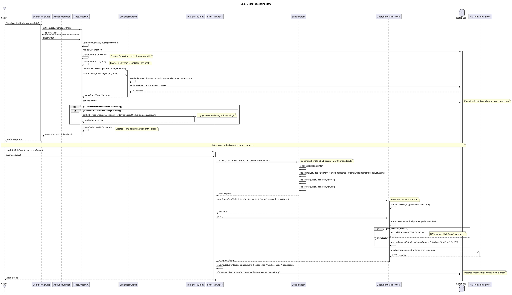

# SUSENG-72

## Place Order

In summary **placeOrder** orchestrates placing an order. In summary, it:

- Validates required fields (e.g. print vendor, shipping method).
- Establishes a database connection and begins a transaction.
- Creates the order header by building an OrderGroup record (via createOrderGroup).
- Processes each book in the order by creating order items (via createOrderItems).
- Creates the corresponding order tasks (via createOrderTasks).
- Commits the transaction.
- Iterates over each created task and, if a book’s asset collection is specified, triggers a PDF rendering task by calling the PDF processing service (with up to three retries).
- Generates an HTML order details file (OrderDetails.htm) on the file system.
- Logs orders that require holding (via Notify.logHoldingBinOrders) and sends a notification email to QA accounts if applicable.
- Finally, it returns a status map indicating success or an error.

The `placeOrder()` method in PlaceOrderAPI.java orchestrates the entire process of placing a book order in the system. Here's a breakdown of what it does:

1. **Validation**:
   - Verifies required fields like print vendor and shipping method
   - Returns error status if validation fails

2. **Database Transaction**:
   - Creates a database connection with transaction isolation
   - Creates the order group record (header) via `createOrderGroup()`
   - Creates order item records for each book via `createOrderItems()`
   - Creates order tasks via `createOrderTasks()`
   - Commits all database changes as a single transaction
   - Handles errors with rollback and duplicate order detection

3. **PDF Generation**:
   - For each book with an asset collection ID, triggers PDF rendering via `PdfServiceClient`
   - Implements retry logic (up to 3 attempts) for PDF service calls
   - Skips rendering if specifically requested

4. **Documentation**:
   - Creates an HTML order details file (`OrderDetails.htm`) with links to all book assets
   - Stores this in the order's file system location

5. **Notifications**:
   - Logs orders requiring holding via `Notify.logHoldingBinOrders()`
   - Sends email notifications for QA accounts

6. **Response**:
   - Returns a status map with success/failure indication and order details

The method handles the complete lifecycle of order creation, ensuring all components (database records, rendered files, documentation) are properly created and linked together.

## Printing Order

Collecting workspace informationThe command to print to RPI (or any print vendor) is not directly sent from the `PlaceOrderAPI` class. Instead, this class sets up the order data in the database and triggers PDF rendering, but the actual print command happens later in the workflow.

Looking at the codebase, the actual communication with print vendors happens through the `PrintTalkOrder` class (not visible in this file), which uses PrintTalk XML protocol to submit orders to print vendors. Here's the flow:

1. In `PlaceOrderAPI.placeOrder()`, the method:
   - Creates database records (order group, order items, order tasks)
   - Triggers PDF generation via `PdfServiceClient` for rendering
   - Creates documentation and metadata

2. Later, a separate process (triggered by a task processor) handles the actual print vendor communication:
   - The `PrintTalkOrder.purchaseOrder()` method creates a PrintTalk XML document
   - It sends this XML to the printer using `QueryPrintTalkPrinters.post()`
   - The HTTP request is sent to the print vendor's service URL (configured in the database)

The communication with RPI would use their service endpoint (something like `http://uos.rpiprint.com/uossoap/uos_soap.asmx/SubmitRequest` based on the migration files in the codebase).

This separation of concerns allows the order placement to happen quickly while the more time-consuming processes of PDF rendering and printer communication happen asynchronously.

## Book Order Processing Flow

1. **Initial Order Processing**:
   - Client sends order data to BookServService
   - PlaceOrderAPI validates and creates database records
   - Order data is saved in OrderGroup, OrderItem and OrderTask tables

2. **PDF Generation**:
   - For books with asset collection IDs, PDFs are rendered via PdfServiceClient
   - HTML documentation is created

3. **Print Vendor Communication**:
   - PrintTalkOrder generates XML via SyncRequest
   - QueryPrintTalkPrinters sends the XML to the printer
   - Special handling for RPI printers which require an "XMLOrder" parameter
   - Response from printer is processed and order status is updated



## Implementing Tradebook with Wireo Binding Using Cover Type Approach

To implement tradebook with wireo binding by treating it as a special cover type (similar to "imagewrap-wireo"), I recommend the following approach:

### 1. Database Schema Update

First, create a migration script to add the new binding configuration:

```sql
-- Add new cover type entry for imagewrap-wireo
INSERT INTO covertype (name, flaps, public_name, bleed)
VALUES ('imagewrap-wireo', 0, 'Wireo-bound tradebook', 22);

-- Get the new covertype ID
SET @new_covertype_id = LAST_INSERT_ID();

-- Add capabilities for the new cover type with tradebook paper types
INSERT INTO coverbindingtypepapercapability (covertypeid, papergroupid, gutspapertypeid, active)
SELECT @new_covertype_id, p.papergroupid, p.id, 1
FROM papertype p
WHERE p.type LIKE '%trade%';
```

### 2. Modify PrintTalkHelper.java

Add a new condition in `getPrinterBindingType()` to handle the special case:

```java
private String getPrinterBindingType(LineItem item) {
    try {
        // Special case for tradebooks with wireo binding
        if (item.getBookOptions().getGutsPaperType().isTradePaper() &&
            "wireo".equals(item.getBookOptions().getCoverBindingType().getName())) {
            return "wireo-tradebook";  // New binding type identifier for RPI
        } else if ("wireo".equals(item.getBookOptions().getCoverBindingType().getName())) {
            return "wireo";
        }
        // Rest of the existing conditions...
    } catch (Exception e) {
        // Error handling...
    }
}
```

### 3. Modify `createBinding()` in PrintTalkHelper.java to Use Custom Element for Wireo Tradebook

```java
private Element createBinding(Document doc, String id, String title, String author, LineItem item) {
    Element bi = doc.createElement("BindingIntent");
    bi.setAttribute("ID", id);
    bi.setAttribute("Class", "Intent");
    bi.setAttribute("Status", "Available");
    bi.setAttribute("BindingOrder", "Collecting");

    Element e = doc.createElement("BindingType");
    e.setAttribute("DataType", "EnumerationSpan");
    String bindingType = getPrinterBindingType(item);
    e.setAttribute("Preferred", item.getBlurbBook().getPrintTalkBookSize() + bindingType);
    bi.appendChild(e);

    // Determine which binding element to use
    boolean isWireoTradebook = item.getBookOptions().getGutsPaperType().isTradePaper() &&
        "wireo".equals(item.getBookOptions().getCoverBindingType().getName());

    String elementType;
    if (isWireoTradebook) {
        // Create a custom element for wireo tradebooks that RPI will recognize
        elementType = "WireoTradeBinding";
    } else if (item.getBookOptions().getCoverBindingType().getName().contains("perfect") ||
               item.getBookOptions().getCoverBindingType().getName().contains("saddle")) {
        elementType = "PaperBackBinding";
    } else {
        elementType = "HardCoverBinding";
    }

    Element bindingElement = doc.createElement(elementType);
    bi.appendChild(bindingElement);

    // The rest of binding element attributes...
```

### 4. Add Custom Integration with RPI's XSLT

Since RPI's XSLT might not recognize our custom elements, create a bridge in SyncRequest.java to translate the concept:

```java
public String xml4PO(OrderGroup og, PrintVendor printer, Connection db, List<OrderItem> orderItems, StringWriter writer) throws Exception {
    // ... existing code ...

    // Special handling for RPI for wireo tradebooks
    if (RPI_PRINTERS_IDENTITY.equalsIgnoreCase(printer.getIdentity())) {
        po.setAttribute("WireoTradeBookCount", countWireoTradeBooks(orderItems));
    }

    // ... rest of the method ...
}

private String countWireoTradeBooks(List<OrderItem> orderItems) {
    int count = 0;
    for (OrderItem item : orderItems) {
        try {
            LineItem lineItem = new LineItem(db, item, true, null, null, false, false);
            if (lineItem.getBookOptions().getGutsPaperType().isTradePaper() &&
                "wireo".equals(lineItem.getBookOptions().getCoverBindingType().getName())) {
                count++;
            }
        } catch (Exception e) {
            Log.error("Error counting wireo tradebooks", e);
        }
    }
    return String.valueOf(count);
}
```

### 5. Modify SKU Generation

Add a special case in `generateProductId` to create distinct SKUs for wireo tradebooks:

```java
public static String generateProductId(LineItem item, BookserveSettingDAO bookserveSettingDAO) {
    // Check for wireo tradebook
    try {
        if (item.getBookOptions().getGutsPaperType().isTradePaper() &&
            "wireo".equals(item.getBookOptions().getCoverBindingType().getName())) {
            return item.getOrderItem().getCoverDesignGUID() + "_" + item.getOrderItem().getBookGUID() + "_" +
                   "wireotrade_" + item.getBookOptions().getGutsPaperType().getAbbrType();
        }
    } catch (Exception e) {
        Log.error("Error generating product ID for wireo tradebook", e);
    }

    // Existing logic...
}
```

### 6. Coordination with RPI's System

The critical part is coordinating with RPI to ensure they recognize and properly handle this new binding type. This requires:

1. Communication with RPI about the new binding type
2. Create a test book with this binding and validate with RPI in their test environment
3. Agreement on the SKU format that will be generated (e.g., `PocketBookWireo_StandardBWMatte_6by9`)

### 7. Update RPI's Map in the XSLT

Request RPI to add a new mapping in their XSLT for wireo tradebooks:

```xml
<xsl:when test="$paperType='STANDARD-TRADE-BW-MATTE-PAPER' and contains($productID,'-WIREO')">
    <xsl:value-of select="'PocketBookWireo'" />
</xsl:when>
```